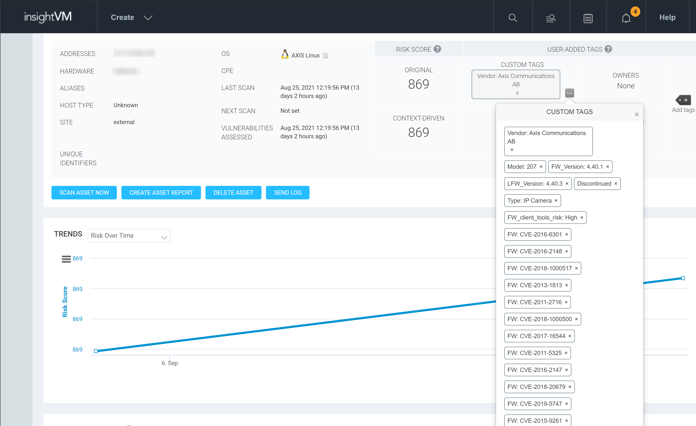

# Introduction

This repository hosts a sample application that demonstrates integrating Firmalyzer's [IoTVAS API](https://firmalyzer.com/iotvas-api) with the Rapid7 [InsightVM](https://www.rapid7.com/products/insightvm/) platform. This integration  enables InsightVM users to:

* accurately identify IoT/connected devices and their vulnerabilities in the firmware code level

* track and manage discontinued, outdated and vulnerable devices from within InsightVM platform

# Installation

Clone the repository content to a local folder and issue the following commands:

```
python3 -mvenv env
source env/bin/activate
pip install -r requirements.txt

```

Note: This application is based on the InsightVM API client (located at rapid7vmconsole folder) generated from API specification of InsightVM console version 6.6.101. If you have a different version installed and you receive InsightVM API errors, please replace rapid7vmconsole folder with the python API client generated using your server API specification accessible via https://insightvm:3780/api/3/html/json

# Configuration

The following parameters should be set in the config.py file before using the application:

1. Url to your InsightVM console (vmconsole_url)

2. Username and password of the InsightVM account with "Mange Tags" and "View Site Asset Data" permissions. This account will be used to connect to your InsightVM server (vmconsole_user and vmconsole_password)

3. Path to the PEM file that contains TLS certificate of your InsightVM console (vmconsole_ssl_ca_cert). This is used by the InsightVM API client to verify certificate of your InsightVM server. This parameter is required if you want to keep vmconsole_verfiyssl = True

4. Your IoTVAS Enterprise plan API key (iotvas_apikey). Trial keys can be obtained from [here](https://iotvas-api.firmalyzer.com/portal/signup).

# Usage

This application accepts a target list file and optional excluded addresses file. Both files can contain hostname, individual IP addresses or IP address ranges in CIDR notation. Example targets.txt and excludes.txt files are included in this repository. 

```
(env) python iotvas-rapid7.py -t targets.txt

```

|  | 
|:--:|
| *IoTVAS augments an InsightVM IoT asset* |

The following video demonstrates usage of this application:

[](https://www.youtube.com/watch?v=TGpgjGVGclo)
